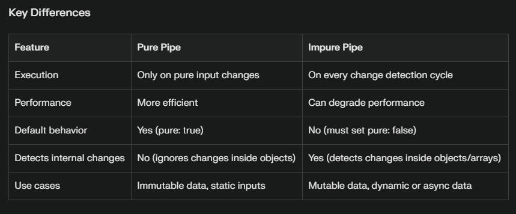

# Angular Concept

## Table of Contents
- [Pipes](#pipe)

## Pipe

### What Are Pipes in Angular?
Pipes transform data in Angular templates for display. Angular supports two types of pipes based on how and when they execute:
- 1. Pure Pipes
  Pure pipes execute only when Angular detects a pure change in the input. A pure change means:
  -  Change in primitive input values (string, number, boolean, symbol).
  -  Change in object reference (not changes within the object).

  Performance: Optimized and efficient because they run only when inputs change.
  Default: Pipes are pure by default (pure: true).
  Use case: Ideal for immutable data or when inputs rarely change.
- 2. Impure Pipes
  Impure pipes run on every change detection cycle, regardless of whether the input reference or primitive has changed.
  - Performance: Less efficient because they execute frequently, potentially causing performance issues.
  - Declaration: Marked with pure: false in the @Pipe decorator.
  - Use case: Useful when dealing with mutable data like arrays or objects that change internally without changing their reference, or when the pipe depends on external or asynchronous data.

  

  